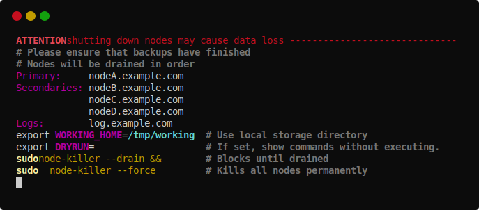
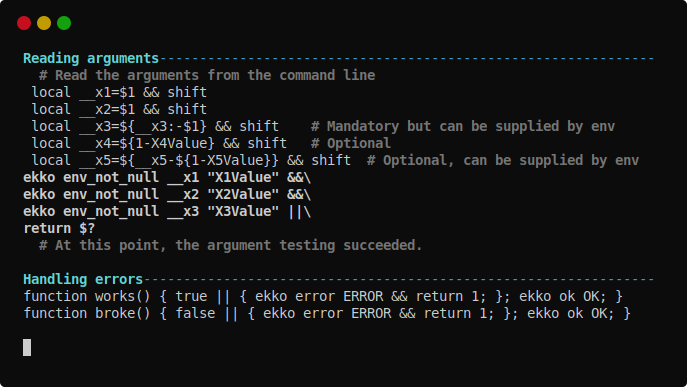
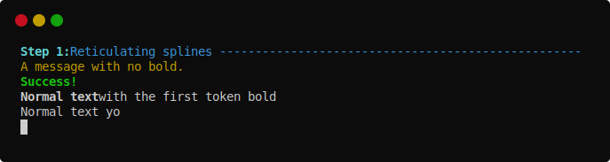

= `ekko` - Simple bash `echo` replacement with colour

Bored of tiresome, unreadable `echo` in your bash scripts? Replace them with `ekko` to bring a bit of colour to your terminal!

Just clone, `source ./bin/ekko.sh` in your `.bashrc` and start generating simple ANSI coloured output!

[cols="3a,2",frame=none,grid=none]
|====
|
*Boring echo*
|
|
// boring_echo
[source,bash]
----
echo ATTENTION!! shutting down nodes may cause data loss -----
echo \# Please ensure that backups have finished
echo \# Nodes will be drained in order
echo Primary: nodeA.example.com
echo Secondaries: nodeB.example.com
echo "    nodeC.example.com"
echo "    nodeD.example.com"
echo Logs: log.example.com
echo export WORKING_HOME=$WORKING_HOME \# Use local storage directory
echo export DRYRUN= \# If set, show commands without executing
echo sudo node-killer --drain \&\& \# Blocks until drained
echo "  sudo" node-killer --force \# Kills all nodes permanently
----
|

|
*Thrilling ekko*
|
|
// thrilling_ekko
[source,bash]
----
ekko banner_error "ATTENTION" shutting down nodes may cause data loss
ekko \# Please ensure that backups have finished
ekko \# Nodes will be drained in order
ekko kv_15 Primary nodeA.example.com
ekko kv_15 Secondaries nodeB.example.com
ekko kv_15 "" nodeC.example.com
ekko kv_15 "" nodeD.example.com
ekko kv_15 Logs log.example.com
ekko \#_export_35 WORKING_HOME "Use local storage directory"
ekko \#_export_35 DRYRUN "" "If set, show commands without executing."
ekko \#_warn_35 sudo node-killer --drain \&\& "Blocks until drained"
ekko \#_warn_35 "  sudo" node-killer --force "Kills all nodes permanently"
----
|

|====

== Built-in help

[cols="2a,2a",frame=none,grid=none]
|====
|
`ekko_help`
image:./doc/ekko_help.svg[ekko_help terminal capture]
|
`ekko_help_examples`

|====

== Usage

----
ekko [MARKER] This is my message!
----

The simple markers assign some colour and bold to the message. The first argument is set to bold and attached back to the rest.

* *`msg`* or *`msg1`*, *`msg2`*, *`msg3`*: Information (cyan, blue, magenta)
* *`error`*: Error (red)
* *`warn`*: Warning (yellow)
* *`ok`*: Success (green)
* *`bold`* or *`b`*: Only sets bold with no colour change
* Adding *`banner_`* prefix to a simple marker fills the rest of the line with `----`

[cols="2a,2",frame=none,grid=none]
|====
|
// ekko_help_1_marker
[source,bash]
----
ekko banner_msg "Step 1:" Reticulating splines
ekko warn "" A message with no bold.
ekko ok Success!
ekko b "Normal text" with the first token bold
ekko Normal text yo
----
|

|====

Comments are entirely in bold and prepended with a `#`.

* *`comment`* or *`\#`*: Adds a `#`, and sets the entire line to bold grey.
* Adding *`comment_`* prefix to a simple marker adds the last argument as a `# comment`
* A *`comment_`* prefix and *`_&lt;NN&gt;`* suffix aligns the comments at column `&lt;NN&gt;`

[cols="2a,2",frame=none,grid=none]
|====
|
// ekko_help_2_comment
[source,bash]
----
ekko comment_warn_35 Attention: possible data loss "Check the"
ekko comment_b_35 sudo mkfs -t vfat /dev/sdX1 "partition"
ekko comment Follow the prompts here
----
|

|====

Some other markers generate different, preformatted output.

* *`kv`* Key/Value: prints the first word of the message right-aligned to column 30 (violet) followed by the rest (default colour).
* *`kv_<NN>`* As above, with the first argument right aligned to column `<NN>`.
* *`export`* prints an export line with the first word of the message. If there is more to the message text, the rest is used as the value. Otherwise, the actual environment variable corresponding to the first work is printed.
* *`env_not_null`* verifies that the first word of the message is set as an environment variable and prints nothing if true. If false, an error message is printed using the rest of the message text and the return code `$?` is set to `1` (error).

[cols="2a,2",frame=none,grid=none]
|====
|
// ekko_help_3_other
[source,bash]
----
ekko kv host $HOSTNAME
ekko kv port 8080
ekko export HOSTNAME
ekko export PORT 80 # Does not set the environment variable!
ekko env_not_null PORT 8080
----
|

|====

You can also use the *`exec`* or *`no-exec`* markers to execute other commands.

* *`exec`* prints the message text (grey background) before trying to execute it as a command, and writes the time it took afterwards. The `EKKO_LAST_EXEC_TIME` is set to this value in milliseconds. The return code is the same as the command.
* *`no-exec`* just prints the command in the same style without trying to execute it.
* Commands are executed with `bash -c &quot;$*&quot;`. Simple commands should work, but you will probably be unhappy with aliases and non-exported functions!

[cols="2a,2",frame=none,grid=none]
|====
|
// ekko_help_4_exec
[source,bash]
----
ekko exec find /tmp
ekko no-exec find /tmp
----
|

|====

If you are on a system with the `notify-send` command (like https://developer.gnome.org/notification-spec/[gnome]), you can execute two types of popups.

* *`popup`* Sends the message to the notification center directly.
* *`remind`* Starts a background process that sleeps for `N` seconds before displaying. If the argument is non-numeric, try to parse it into seconds using the linux `date` command.

// Exec
----
ekko popup Splines have been reticulated
ekko remind $((5 * 60)) Five minute break is finished
ekko remind 25min Pompodoro #1 is ended
ekko remind "1 day 1 hour" Water your plants
----

== "Building" and Testing

There are some some https://bats-core.readthedocs.io/en/stable/[BATS] unit tests included with the project.

[source,bash]
----
# Clone including submodules to include the BATS framework and testing tools.
git clone --recurse-submodules git@github.com:RyanSkraba/ekko.git
# Alternatively, update the submodules in place.
git submodule update --init --recursive

# Run the tests
test/ekko.bats
----
