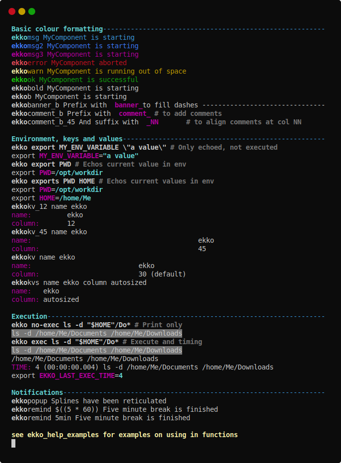

ekko
==============================================================================

Simple bash echo replacement with colour semantics.

I got tired of boring `echo`s from my bash scripts.  This is a small and simple drop-in replacement that uses the first argument to assign some colour to your terminal!

Add it to your `.bashrc` and start generating simple ANSI coloured output!

```
source ./bin/ekko.sh
ekko_help
```



Usage
==============================================================================

```
ekko [MARKER] This is my message!
```

The simple markers assign some colour and bold to the message:
* `msg`: Information (cyan)
* `error`: Error (red)
* `warn`: Warning (yellow)
* `ok`: Success (green)
* `bold` or `b`: Other (no colour change)
* Adding `banner_` prefix to a simple marker fills the rest of the line with `----`

The first argument is set to bold automatically and attached back to the rest.

```
ekko banner_msg "Step 1:" Reticulating splines
ekko warn "" A message with no bold.
ekko ok Success!
```

Some other markers generate different output:
* `kv` Key/Value: prints the first word of the message right-aligned to column 30 (violet) followed by the rest (default colour).
* `kv_`<NN> As above, with the first argument right aligned to column <NN>.
* `export` prints an export line with the first word of the message.  If there is more to the message text, the rest is used as the value.  Otherwise, the actual environment variable corresponding to the first work is printed. 
* `env_not_null` verifies that the first word of the message is set as an environment variable and prints nothing if true.  If false, an error message is printed using the rest of the message text and the return code `$?` is set to `1` (error).

```
ekko kv host $HOSTNAME
ekko kv port 8080
ekko export HOSTNAME
ekko export PORT 80 # Does not set the environment variable!
ekko env_not_null PORT 8080
```

You can also use the `exec` or `no-exec` markers to execute other commands.
* `exec` prints the message text (grey background) before trying to execute it as a command, and writes the time it took afterwards.  The `EKKO_LAST_EXEC_TIME` is set to this value in milliseconds.  The return code is the same as the command.
* `no-exec` just prints the command in the same style without trying to execute it.
* Commands are executed with `eval $'bash -c "'$@'"'`.  Simple commands should work, but you'll probably be unhappy with aliases and non-exported functions!

```
ekko exec find /tmp
ekko no-exec find /tmp
```

If you are on a system with the `notify-send` command (like [gnome][notify-send]), you can execute two types of popups:
* `popup` Sends the message to the notification center directly.
* `remind` Starts a background process that sleeps for `N` seconds before displaying.

```
ekko popup Splines have been reticulated
ekko remind $((5 * 60)) Five minute break is finished
```

[notify-send]: https://developer.gnome.org/notification-spec/
